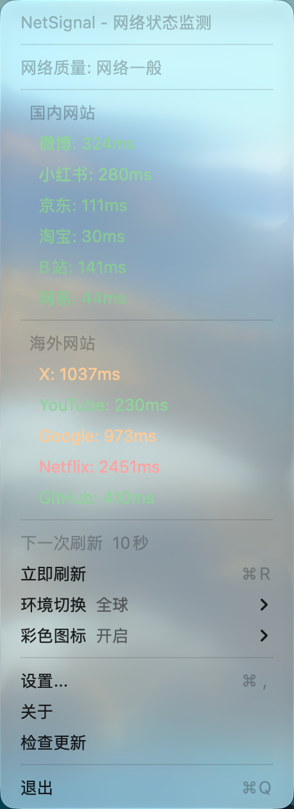

# NetSignal - macOS 网络状态监测工具

<p align="center">
  
</p>

NetSignal 是一款 macOS 菜单栏应用，通过监测国内外主要网站的访问速度，用直观的信号格图标反映当前网络状态。

<p align="center">
  
  
</p>
<p align="center"><small>非彩色 / 彩色</small></p>

## 特性

- **信号格显示**：类似手机信号图标，1-4 格直观展示网络好坏
- **国内外区分**：同时监测国内网站（微博、小红书、京东、淘宝、B站、网易）和海外网站（X、YouTube、Google、Netflix、GitHub）
- **实时测速**：HEAD 请求测量网站响应时间（DNS + 连接 + 首字节）
- **自动刷新**：支持自定义刷新间隔（10-300 秒）
- **自定义网站**：可添加、删除、启用/禁用监测网站
- **开机启动**：支持设置开机自启
- **菜单倒计时**：菜单打开时显示"下一次刷新 X秒"倒计时
- **免费开源**：所有功能免费使用，无需付费

## 下载安装

- **GitHub Releases**：[v1.0.0 下载](https://github.com/jesse2023wang-ai/NetSignal/releases/tag/v1.0.0)（NetSignal-1.0.0.dmg）
- 下载后打开 `.dmg`，将 NetSignal 拖入 Applications 文件夹即可

## 测速标准

| 响应时间 | 状态 | 颜色 |
|---------|------|------|
| < 200ms | 极快 | 🟢 绿色 |
| 200-500ms | 良好 | 🟢 绿色 |
| 500-1500ms | 一般 |  橙色 |
| > 1500ms | 较慢 | 🔴 红色 |
| 超时 | 超时 | ⚪ 灰色 |

## 信号格规则

| 平均响应时间 | 信号格 | 描述 |
|------------|-------|------|
| < 200ms | 4格 | 网络极佳 |
| 200-500ms | 3格 | 网络良好 |
| 500-1500ms | 2格 | 网络一般 |
| > 1500ms | 1格 | 网络较差 |
| 全部超时 | 0格 | 无网络 |

## 使用

- **左键点击菜单栏图标**：立即刷新网络检测
- **右键点击菜单栏图标**：打开功能菜单
- **菜单项**：
  - 立即刷新
  - 设置（自定义网站、自动刷新、开机启动）
  - 关于
  - 检查更新
  - 退出

## 构建

```bash
cd NetSignal
swift build
swift run
```

## 与竞品的区别

| 功能 | Ethernet Status | NetSignal |
|------|----------------|-----------|
| 菜单栏显示 | 支持 | 支持 |
| 信号格图标 | 不支持 | ✅ 支持 |
| 国内外网站测速 | 不支持 | ✅ 支持 |
| 自定义网站 | 不支持 | ✅ 支持 |
| 高级功能付费 | 是 | ✅ 否（全部免费） |
| 菜单倒计时 | 不支持 | ✅ 支持 |

## 系统要求

- macOS 13.0+
- Swift 5.9+

## 许可证

MIT License
